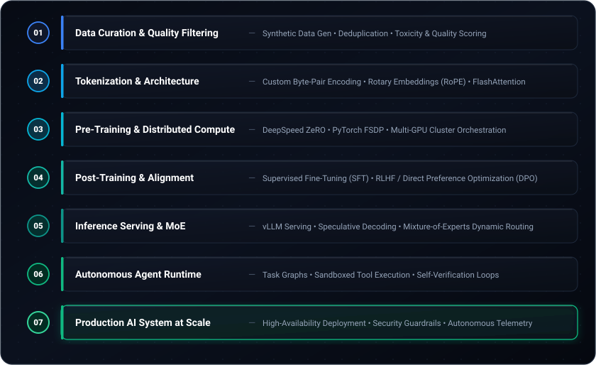
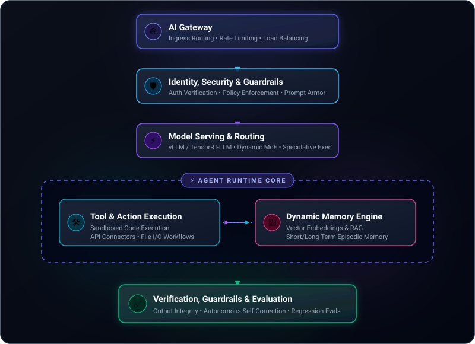

  <!-- Dynamic Typing Header: Writing effect without local files -->
  

  

    <strong>Building intelligent systems and autonomous agent infrastructure from first principles.</strong>
  

  

    
    
    
    
  

---

### ⚡ Executive Summary

I am an **AI Engineer and Founder** based in Bangladesh, dedicated to engineering frontier-grade intelligence systems from the ground up. 

My work sits at the intersection of **Large Language Models (LLMs), Agentic AI, Autonomous Software Engineering, Cybersecurity, and High-Performance AI Infrastructure**. Rather than treating modern artificial intelligence merely as an external API layer, my focus is on understanding the core mechanics—how models learn, how inference is optimized, and how resilient, production-ready multi-agent architectures are engineered around them.

---

### 🚀 What I'm Building

#### 🤖 [Craftly](https://github.com/iammahmudhasan)
*An AI-focused technology company building intelligent infrastructure and next-generation software building systems.*

* **Craftly Robot**: An autonomous agentic AI system engineered to transcend simple conversational chat, autonomously understanding codebases, executing complex multi-step development tasks, and verifying output integrity.
* **Craftly Workspace**: An internal enterprise operations platform centered around evidence-based workflows, verifiable identity & access governance, hierarchical task management, and seamless human-agent collaboration.

#### 🧬 [Aeitron](https://github.com/iammahmudhasan)
*A frontier intelligence research and development project focused on agentic autonomy and cyber defense.*

* **Autonomous Reasoning & Coding**: Architecting systems that ingest code repositories, plan architectural refactors, implement changes, and self-heal via continuous test & verification loops.
* **Agentic Cybersecurity**: Engineering intelligent models that reason about complex software landscapes to proactively identify vulnerabilities and defend distributed infrastructure.

---

### 🧠 How I Think About AI Systems

I approach machine learning from **first principles**: mastering both the foundational mathematics and the distributed software engineering required to run scalable, reliable systems.

  

---

### 🔬 Core Research & Engineering Pillars

| Area | Focus Topics |
| :--- | :--- |
| **Large Language Models** | Transformers, FlashAttention, Tokenization, Pre-training, SFT / DPO, Model Distillation, Mixture of Experts (MoE) |
| **Agentic AI** | Multi-Agent Orchestration, Task Graphs, Dynamic Memory, Verification Loops, Autonomous Code Synthesis |
| **AI Systems & Infra** | Model Serving, Distributed Training (FSDP, DeepSpeed), GPU / CUDA Optimization, Data Pipelines |
| **Cybersecurity × AI** | Automated Threat Modeling, Autonomous Vulnerability Auditing, Defensive Agentic Intelligence |

---

### 🧩 Architectural Blueprint

A high-level blueprint of the agent platform ecosystem I actively research and construct:

  

---

### 🛠️ Tech Stack & Tooling

  <strong>Artificial Intelligence & Machine Learning</strong> 
  
  
  
  
  
  

  <strong>High-Performance Systems & Backend</strong> 
  
  
  
  
  

  <strong>Infrastructure, Distributed Systems & Storage</strong> 
  
  
  
  
  
  

---

### 📊 GitHub Activity & Analytics

  <!-- 1. Contribution Graph -->
  

    

  <!-- 2. Stats & Streak Side-by-Side -->
  

    
    &nbsp;&nbsp;
    
  

  <!-- 3. Most Used Languages -->
  

    
  

---

### 🎯 Long-Term Vision & Mission

> **"Build. Break. Understand. Rebuild."**

* **Frontier Engineering**: Advance beyond superficial model utilization to contribute meaningfully to foundational AI research and resilient agentic infrastructure.
* **Building from Home (Bangladesh 🇧🇩)**: Proving that ambitious, globally competitive deep tech can be conceived, engineered, and scaled locally to inspire the next generation of engineers and researchers.

---

### 🤝 Let's Connect

Feel free to reach out for collaborations on agentic systems, AI research, distributed infrastructure, or startup ventures.

  
  &nbsp;
  
  &nbsp;
  
  &nbsp;
  

    

  ✨ <i>"Don't just use the future. Build it."</i> ✨

