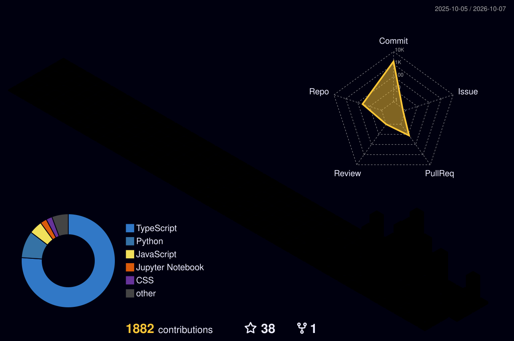

  <!-- Dynamic Typing Header: Writing effect without local files -->
  

  

    
    
    
    
  

---

### Executive Summary

I build frontier grade intelligence systems and AI native products, from the ground up. My role sits at the intersection of AI Engineer, COO, and Entrepreneur.

Most of my work centers on Large Language Models, Agentic AI, Software Engineering, and High Performance AI Infrastructure. I care about how these systems actually work under the hood model training, inference optimization, agent design, memory, orchestration, and the production infrastructure that holds it all together.

Beyond the engineering side, I spend a good chunk of my time on product strategy, system architecture, and leading teams taking AI capabilities that are still maturing and turning them into systems that actually hold up in production: scalable, reliable, and built to last. What I'm ultimately trying to do is help shape the next wave of intelligent software, through solid engineering, real experimentation, and a long-term view of where this technology is headed.

---

### What I'm Building

#### [Craftly](https://craftlyrobot.com)
*An AI technology company building intelligent AI system, and AI native infrastructure redefining how people and organizations build, operate, and work with technology.*

* **Craftly Robot**: An agentic AI system built for every domain in the world. It understands complex codebases, and different kind of knowledge that solves real problems.
* **Craftly Workspace**: An intelligent enterprise operations platform bringing structure, accountability, and automation to organizations through evidence based systems.

#### [Aeitron AI](https://aeitron.com)
*An AI automation company helping businesses turn repetitive, complex, and time consuming operations into scalable, automated systems.*

* **AI Automation**: AI powered workflows connecting business processes, applications, data, and teams automating operational work and cutting down manual effort.
* **Agentic Automation**: Intelligent AI agents that understand business context, make decisions, execute multi step workflows, and coordinate with other systems and agents.
* **Custom AI Systems**: Tailored automation built with LLMs, AI agents, workflow orchestration, APIs, and modern AI infrastructure solving real business problems.

---

### Long-Term Vision & Mission

> **"Build. Break. Understand. Rebuild."**

* **Frontier Engineering**: Advance beyond superficial model utilization to contribute meaningfully to foundational AI research and resilient agentic infrastructure.
* **Building from Home (Bangladesh)**: Proving that ambitious, globally competitive deep tech can be conceived, engineered, and scaled locally to inspire the next generation of engineers and researchers.

---

### Tech Stack & Tooling

<h4 align="center">Artificial Intelligence & Machine Learning</h4>

  

<h4 align="center">LLM Inference & Optimization</h4>

  

<h4 align="center">High-Performance Systems & Backend</h4>

  

<h4 align="center">Infrastructure, Distributed Systems & Storage</h4>

  

<h4 align="center">MLOps & Experiment Tracking</h4>

  

<h4 align="center">AI Workflow, Automation & Cloud</h4>

  

---

### 3D Contribution Landscape

  

---

### Analytics

  <!-- 1. Top: Streak Stats (Black background, Cyan flame & ring accents, White numbers) -->
  

    
  

   

  <!-- 2. Middle Row: GitHub Statistics (Black background, Cyan titles & icons) -->
  

    
  

   

  <!-- 3. Bottom: Contribution Graph ("My Contributions", Black background, Cyan line & area fill, White dots) -->
  

    
  

---

### Licenses & Certifications

| Certificate | Issuer | Credential ID | Verification |
| :--- | :--- | :---: | :---: |
| **Gemini Certified Educator** | Google for Education | `187234186` | [↗ View Credential](https://www.linkedin.com/in/iammahmudhasan/details/certifications/) |
| **Building with the Claude API** | Anthropic | `t58vjj5sst8y` | [↗ View Credential](https://www.linkedin.com/in/iammahmudhasan/details/certifications/) |
| **Claude Code in Action** | Anthropic | `xu53acqwhutx` | [↗ View Credential](https://www.linkedin.com/in/iammahmudhasan/details/certifications/) |
| **Claude Code 101** | Anthropic | `8ofizp9qajew` | [↗ View Credential](https://www.linkedin.com/in/iammahmudhasan/details/certifications/) |
| **AI Fluency: Framework & Foundations** | Anthropic | `ha8qabobbrgb` | [↗ View Credential](https://www.linkedin.com/in/iammahmudhasan/details/certifications/) |
| **Claude 101** | Anthropic | `x9quurqyjwq4` | [↗ View Credential](https://www.linkedin.com/in/iammahmudhasan/details/certifications/) |

---

## Connect & Collaborate

  
  
  
  
  

  

---

  <i>"Don't just use the future. Build it."</i>

